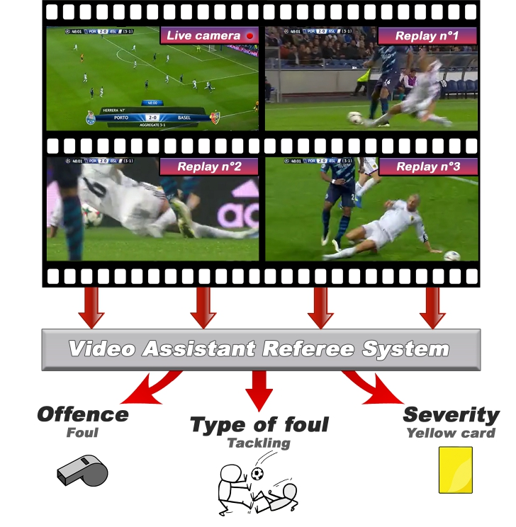
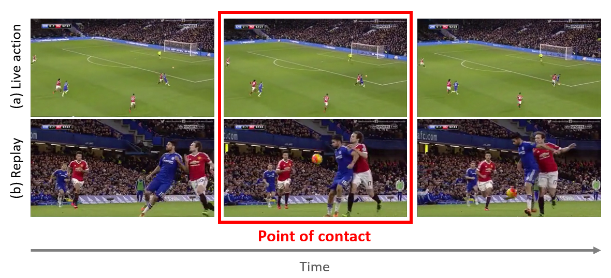
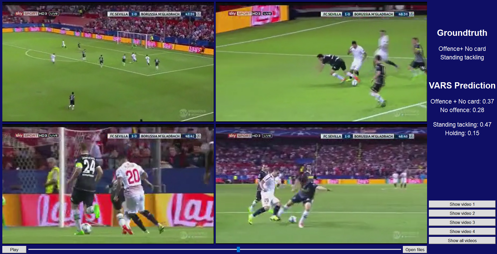

# Video Assistant Referee System - VARS

The Video Assistant Referee (VAR) has revolutionized association football, enabling referees to review incidents on the pitch, making informed decisions, and ensuring fairness. However, due to the lack of referees in many countries and the high cost of the VAR infrastructure, only professional leagues can benefit from it. 
We propose a first step towards a fully automated “Video Assistant Referee System” (VARS) which could support or replace the current VAR.

This repository contains:
 * the SoccerNet-MVFouls, a new multi-view video dataset containing video clips of fouls captured by multiple cameras, annotated with 10 properties.
 * the code for the VARS, a new multi-camera video recognition system for classifying the type of fouls and their severity. 
* the VARS interface, which shows the ground truth of the action and the top 2 predictions for the foul classification task, and the offence and severity classification task with the corresponding confidence scores.

For more information
* Paper: [VARS: Video Assistant Referee System for Automated Soccer Decision Making from Multiple Views](https://arxiv.org/abs/2304.04617).



## SoccerNet-MVFouls

A [SoccerNet pip package](https://pypi.org/project/SoccerNet/)) to easily download the data and the annotations is available.

To install the pip package simply run:

```
pip install SoccerNet
pip install soccernet --upgrade
```

If you want to download the data, you will need to fill a [NDA](https://docs.google.com/forms/d/e/1FAIpQLSfYFqjZNm4IgwGnyJXDPk2Ko_lZcbVtYX73w5lf6din5nxfmA/viewform) to get the password.

Then use the API to downlaod the data:

```
from SoccerNet.Downloader import SoccerNetDownloader as SNdl
mySNdl = SNdl(LocalDirectory="path/to/SoccerNet")
mySNdl.downloadDataTask(task="mvfouls", split=["train","valid","test","challenge"], password="enter_password")
```

The dataset consists of 3901 available actions. Each action is composed of at least two videos depicting the live action and at least one replay. 
The dataset is divided into a training set (2916 actions), validation set (411 actions), test set (301 actions) and challenge set (273 actions without the annotations).



The actions are annotated with 10 different properties describing the characteristics of the foul from a referee
perspective (e.g. the severity of the foul, the type of foul,
etc.). \
To ensure high-quality annotations, all these properties were manually annotated by a professional soccer referee with 6 years of experience and more than 300 official
games.
## VARS

Our VARS is a multi-view multi-task video architecture, that automatically identifies the type of foul and their severity. 


Our system encodes per-view video features (E), aggregates the view features (A), and classifies different properties of the foul action (C).

Run the following lines to install all the dependencies:
```
conda create -n vars python=3.9

conda activate vars

conda install pytorch torchvision cudatoolkit=11.7 -c pytorch -c conda-forge

pip install -r requirements.txt
```

To start the training, run the following command:

```
python main.py --path "path/to/dataset" 
```

## VARS interface

The VARS interface enables easy access to all available
perspectives for a particular action. The multi-task VARS,
which achieved the best results on the test set, is built directly into the interface, allowing for immediate analysis of
selected videos. The VARS interface offers top two predictions for the type of foul classification, as well as the offense and severity classification for the selected videos. Furthermore, for each prediction, the VARS interface shows the confidence score of his prediction.



Run the following lines to instal all the dependencies
```
conda create -n vars python=3.9

conda activate vars

pip install git+https://github.com/ajhamdi/mvtorch

pip install -r requirements.txt
```
Download the weights of the model: https://drive.google.com/drive/folders/1N0Lv-lcpW8w34_iySc7pnlQ6eFMSDvXn?usp=share_link

And save the 8_model.pth.tar file in the folder "interface".

Once the environment is ready, you can simply run the interface with the following command:
```
python main.py
```
Then select one or several clips in the folder "Dataset".


## Demo
The VARS gives his top two predictions with the corresponding confidence score.

Example 1:


Example 2:


## License
See the [License](LICENSE) file for details.


## Citation

For further information check out our [paper](https://arxiv.org/abs/2304.04617) and supplementary material.

Please cite our work if you use our dataset or code.
